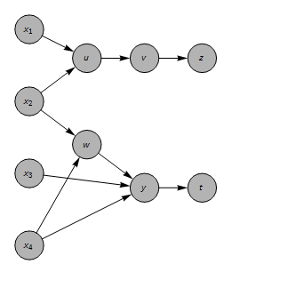

# Plan for QRM
Do we want to build an independent LSMC engine `Algorithmic Adjoint Differentiation`-friendly ?

  - Prototype (learning, Wolfram Language):

    - value a Bermudean option
    - implement LSMC
        - can it be turned on/off ?
    - implement AAD from scratch and check against light-weight automatic AAD
    - consider scenarios where the propagation through LSMC is relevant
    - improve performance
    - re-factor code, use nesting ?
    - implement forward loop
    - implement price factors ?

  - Prototype (Python)

    - value a Bermudean option
    - implement bespoke LSMC
    - use `autograd`

  - Generic LSMC

    - Methodology
        - `numpy`, `MKL` ?
        - can it be turned on/off ?
    - Inputs
    - Requirements on curve simulators and payoffs

# Issues

  - Check values $y_1, y_2$ inside dependencies `<|` $x_1 \longrightarrow y_1, x_2 \longrightarrow y_2$`|>` and drop the ones smaller than a cutoff ? 

## FD

  - Look into poor performance on larger lists.
  - Introduce helper propagation for complex functions ?
  - Manual calculation of sensitivities requires the full `rvs`.
      - Move the calculation of spot to inside the function for the valuation of the  regression coefficients ?
      - Does this make the calculation of the regression coefficients model dependent ?
      - Would that imply doing backward loop and valuation of the regression coefficients at the same time ?
  - Abstract object: things that are needed to make a decision at a given time step.
  - Binary relation of `ad` objects.
  - Equality of `ad` objects.
  - Derivatives of `ad` objects. They cannot be derived from the `ad` object itself.
  - Can one find a transformation after which the sensitivities can be calculated in parallel over exercise days ?

## AD

# Bugs

  - ~~Simple value update, no inverse => sensitivities not matching.~~ FIXED
  - ~~Wrong intrinsic value~~ ? FIXED
  - Bad match between `ad` and `manual` when using modified payoff.
  - Need to define derivative of modified payoff in order to catch singularities: ~~introduce a third argument/flag~~ ? Used alternative approach.

    - ~~Can one define the derivatives~~ ? Used alternative approach.

  - ~~Double check `stheta` at 0 in $\Theta(\mu - 1)$ and $\Theta(\mu - m)$~~. DONE
  - Need the values on the forward loop as well ? Yes.
  - ~~Wrong `dndE`.~~ FIXED
  - ~~Wrong `eBar`, `hBar`~~. FIXED
  - Output all `values`.
  - ~~$\epsilon = 0$ doesn't work.~~ FIXED with taking care of `sdd`.
  - no difference in `outCashflowFwd` using only values or unit sensitivities of forward beta

# Status

  $\epsilon = 0$:

      - match backward loop perfectly
      - match only latest days {19, 20}

  $\epsilon > 0$:

      - bad match; agreement only with intrinsic and 3 ITM

# Performance tests

## Intrinsic
Below refers to: `nE=20`, `nB=5` `sigma=0.0045`.

[40_bkwd]: results_40_bkwd.png
[40_fwd]: results_40_fwd.png
[1000_bkwd]: results_1000_bkwd.png
[1000_fwd]: results_1000_fwd.png
[1000_no_ad_bkwd]: results_1000_no_ad_bkwd.png
[1000_no_ad_fwd]: results_1000_no_ad_fwd.png
[10000_no_ad_bkwd]: results_10000_no_ad_bkwd.png
[10000_no_ad_fwd]: results_10000_no_ad_fwd.png
[30000_no_ad_bkwd]: results_30000_no_ad_bkwd.png
[30000_no_ad_fwd]: results_30000_no_ad_fwd.png

|`nMC`|`elapsed bkwd`|`elapsed fwd`|
|----:|-------------:|------------:|
|40|1.2|0.3|
|1000|351|6.2|
|40 no `ad`|0.1|0.75|
|1000 no `ad`|0.38|0.04|
|10000 no `ad`|3.8|0.4|
|30000 no `ad`|12.3|1.1|

### `nMC=40`

|`bkwd`|`fwd`|
|:-----|:----|
|!["40_bkwd"][40_bkwd]|!["40_fwd"][40_fwd]|

### `nMC=1000`

|`bkwd`|`fwd`|
|:-----|:----|
|!["1000_bkwd"][1000_bkwd]|!["1000_fwd"][1000_fwd]|
|!["1000_no_ad_bkwd"][1000_no_ad_bkwd]|!["1000_no_ad_fwd"][1000_no_ad_fwd]|

### `nMC=10000`

|`bkwd`|`fwd`|
|:-----|:----|
|!["10000_no_ad_bkwd"][10000_no_ad_bkwd]|!["10000_no_ad_fwd"][10000_no_ad_fwd]|

### `nMC=30000`

|`bkwd`|`fwd`|
|:-----|:----|
|!["30000_no_ad_bkwd"][30000_no_ad_bkwd]|!["30000_no_ad_fwd"][30000_no_ad_fwd]|

## Full
Below refers to: `nE=20`, `nB=5` `sigma=0.45`.

[1000_no_ad_full_bkwd]: results_1000_no_ad_full_bkwd.png
[1000_no_ad_full_fwd]: results_1000_no_ad_full_fwd.png
[10000_no_ad_full_bkwd]: results_10000_no_ad_full_bkwd.png
[10000_no_ad_full_fwd]: results_10000_no_ad_full_fwd.png
[30000_no_ad_full_bkwd]: results_30000_no_ad_full_bkwd.png
[30000_no_ad_full_fwd]: results_30000_no_ad_full_fwd.png
[30000_no_ad_full_no_lsmc_bkwd]: results_30000_no_ad_full_no_lsmc_bkwd.png
[30000_no_ad_full_no_lsmc_fwd]: results_30000_no_ad_full_no_lsmc_fwd.png
[30000_no_ad_full_ATM_bkwd]: results_30000_no_ad_full_ATM_bkwd.png
[30000_no_ad_full_ATM_fwd]: results_30000_no_ad_full_ATM_fwd.png
[30000_no_ad_full_ATM_no_lsmc_bkwd]: results_30000_no_ad_full_ATM_no_lsmc_bkwd.png
[30000_no_ad_full_ATM_no_lsmc_fwd]: results_30000_no_ad_full_ATM_no_lsmc_fwd.png

### `nMC=1000`

|`bkwd`|`fwd`|
|:-----|:----|
|!["1000_no_ad_full_bkwd"][1000_no_ad_full_bkwd]|!["1000_no_ad_full_fwd"][1000_no_ad_full_fwd]|

### `nMC=10000`

|`bkwd`|`fwd`|
|:-----|:----|
|!["10000_no_ad_full_bkwd"][10000_no_ad_full_bkwd]|!["10000_no_ad_full_fwd"][10000_no_ad_full_fwd]|

### `nMC=30000`

|`bkwd`|`fwd`|`lsmc`|comment|
|:-----|:----|:-----|:------|
|!["30000_no_ad_full_bkwd"][30000_no_ad_full_bkwd]|!["30000_no_ad_full_fwd"][30000_no_ad_full_fwd]|True|3 ITM|
|!["30000_no_ad_full_no_lsmc_bkwd"][30000_no_ad_full_no_lsmc_bkwd]|!["30000_no_ad_full_fwd"][30000_no_ad_full_no_lsmc_fwd]|False|3 ITM|
|!["30000_no_ad_full_ATM_bkwd"][30000_no_ad_full_ATM_bkwd]|!["30000_no_ad_full_ATM_fwd"][30000_no_ad_full_ATM_fwd]|True|ATM|
|!["30000_no_ad_full_ATM_no_lsmc_bkwd"][30000_no_ad_full_ATM_no_lsmc_bkwd]|!["30000_no_ad_full_ATM_fwd"][30000_no_ad_full_ATM_no_lsmc_fwd]|False|ATM|

### `nMC=5000`

[5000_no_ad_3_itm_full_0_bkwd]: results_5000_no_ad_3_itm_full_0_bkwd.png
[5000_no_ad_3_itm_full_0_fwd]: results_5000_no_ad_3_itm_full_0_fwd.png
[5000_no_ad_3_itm_full_0_0005_bkwd]: results_5000_no_ad_3_itm_full_0_0005_bkwd.png
[5000_no_ad_3_itm_full_0_0005_fwd]: results_5000_no_ad_3_itm_full_0_0005_fwd.png
[5000_no_ad_3_itm_full_0_005_bkwd]: results_5000_no_ad_3_itm_full_0_005_bkwd.png
[5000_no_ad_3_itm_full_0_005_fwd]: results_5000_no_ad_3_itm_full_0_005_fwd.png
[5000_no_ad_3_itm_full_0_05_bkwd]: results_5000_no_ad_3_itm_full_0_05_bkwd.png
[5000_no_ad_3_itm_full_0_05_fwd]: results_5000_no_ad_3_itm_full_0_05_fwd.png

[5000_no_ad_3_itm_full_no_lsmc_0]: results_5000_no_ad_3_itm_full_no_lsmc_0.png
[5000_no_ad_3_itm_full_no_lsmc_0_005]: results_5000_no_ad_3_itm_full_no_lsmc_0_005.png

|`bkwd`|`fwd`|`lsmc`|$\varepsilon$|comment|
|:-----|:----|:-----|:---------|:------|
|!["5000_no_ad_3_itm_full_0_bkwd"][5000_no_ad_3_itm_full_0_bkwd]|!["5000_no_ad_3_itm_full_0_fwd"][5000_no_ad_3_itm_full_0_fwd]|True|0|2min|
|!["5000_no_ad_3_itm_full_0_0005_bkwd"][5000_no_ad_3_itm_full_0_0005_bkwd]|!["5000_no_ad_3_itm_full_0_0005_fwd"][5000_no_ad_3_itm_full_0_0005_fwd]|True|0.0005|17min|
|!["5000_no_ad_3_itm_full_0_005_bkwd"][5000_no_ad_3_itm_full_0_005_bkwd]|!["5000_no_ad_3_itm_full_0_005_fwd"][5000_no_ad_3_itm_full_0_005_fwd]|True|0.005|16min|
|!["5000_no_ad_3_itm_full_0_05_bkwd"][5000_no_ad_3_itm_full_0_05_bkwd]|!["5000_no_ad_3_itm_full_0_05_fwd"][5000_no_ad_3_itm_full_0_05_fwd]|True|0.05|1.4min|

# Working with the graph

Example valuation:

  - How to represent an array or matrix ?
  - ~~Should a vertex contain information about the jacobian ?~~
  - ~~How to programmatically add verices at each calculation ?~~

    - ~~Use a random number or symbol ?~~
  - How to reconstruct the full jacobian for each output ?

    - Need to keep track of variables at each node as well ?

  - Generalise `AD` to arbitrary number of inputs ?
  - Use `VertexCapacity`, `EdgeCapacity` to embed tape in graph ?
  - As all Jacobians need to be evaluated, is the gain in `AD` coming from a more efficient usage of matrix multiplication ?
  - How to handle functions containinig a parameter which one wished to consider a constant ?
  - How to find all input and output vertices ?
  - Use functions with mixed arguments, `ad` and numeric.
  - Template for derivatives: it needs a smarter levelspec. Need to use `Derivative` because arguments can be numeric.
  - Need to store all intermediate steps as named variables in order to avoid duplications ?
  - Need to consider `Union[argsAAD]` in order to avoid double counting ? Is a default way of combining `Association`s acting to properly add the sensitivities ?
  - Replace `Derivative` with `D` after substitution ?
